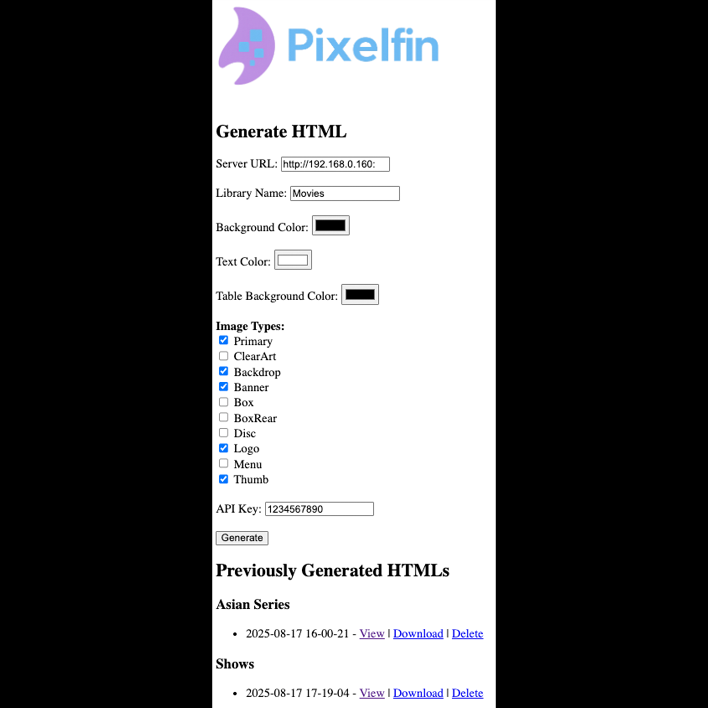
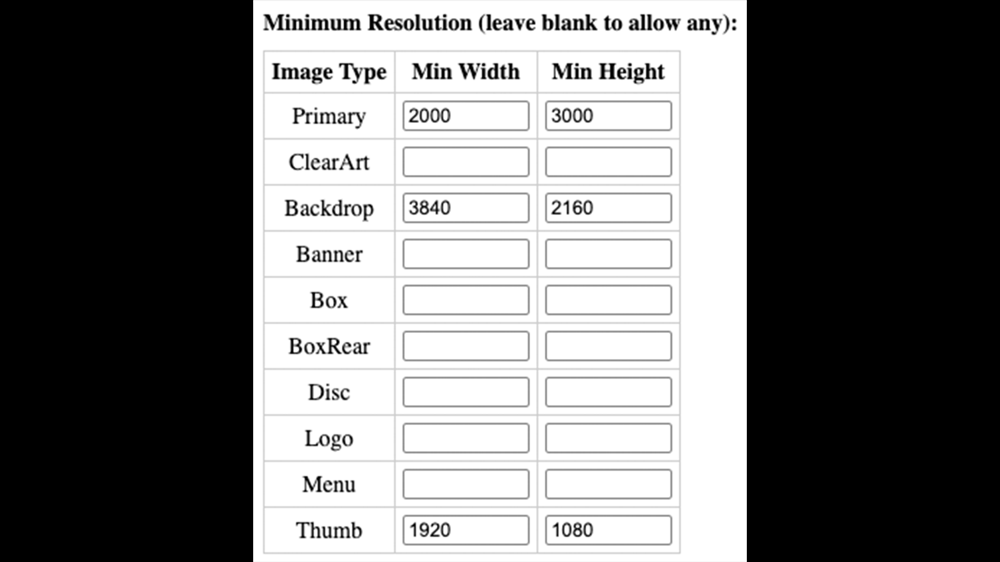

# Pixelfin – Jellyfin Image Inspector

Do you want your images on your Jellyfin instance to be perfect?

Do you ever wonder which image types you're missing or are low resolution?

Pixelfin is a lightweight Flask app paired with a generator script that lets you quickly create HTML galleries of your Jellyfin libraries. It highlights which image types — such as Primary, ClearArt, Backdrops, Logos, and more — are present, which are missing, and which fall below a minimum resolution threshold you specify. The result is a clean, scrollable gallery with clickable images, accompanied by a summary table showing missing and low-resolution images.

I vibe-coded this project entirely with ChatGPT, because I have literally zero coding experience. It works for me, and I personally use it to keep track of artwork across my Jellyfin setup. If you’re more experienced with coding than I am (which is basically everyone), feel free to improve it or collaborate — I’d love that.

---

## Screenshots

### Main Page


### Minimum Resolution


### All Image Types - Summary Table


### All Image Types - Entry with Missing Images


### Certain Image Types - Summary Table


### Certain Image Types - Entry with No Missing Images


### Certain Image Types - Entry with Missing Images


### Certain Image Types - Entry with Low Resolution Images


### Lightbox with Navigation


## 🙋 About This Project

This project is **functional, not perfect or polished**.

If you try it out:
- If it won't start, make sure `history.json` exists as an **empty file**, not a folder. Then run rebuild the container (not just restart it).
- Depending on the size of the library, it can take some time and memory to generate an HTML file or download an embedded HTML file.   

This tool works for me, and I actively use it to manage artwork in my own Jellyfin setup. If you’re more experienced, you’ll almost certainly see ways to improve it. Contributions, fixes, and feedback are all very welcome, but I honestly wouldn't know how to act upon them without help. I'm just being real with you. I’d love to collaborate with anyone who finds this interesting.

---

## ✨ Features

- **Web interface (Flask app)**
	- Enter your Jellyfin server, API key, and library name
	- Choose colors for the gallery
	- Select which image types to include
	- Generate new HTML reports
	- View previously generated galleries, download them with embedded images, or delete them
- **Automatic galleries (generate_html.py)**
	- Each item in the library with its images
	- Missing images highlighted with placeholders
	- Low resolution images indicated with red captions
	- A summary table at the top listing which image types each item is missing or is considered low resolution; clicking on a title directs you to that entry
	- Clickable images with a lightbox viewer (Prev / Next / Close)
- **Direct links to Jellyfin**
	- Each item’s title links directly to its page in Jellyfin’s web UI so you can take action and make edits
	
- **Image resolution display**
	- Under every image, its image type and resolution is shown (e.g. Backdrop 1920×1080)
	
- **Actionable image callouts**
	- For each entry, missing image or low resolution image types are listed in red so you don’t miss them
	

---

## 🚀 Installation (Without Docker)

### Requirements

- Python 3.9+
- Pip
- A Jellyfin server + API key

### Install dependencies

```bash
pip install flask pillow requests

```

### Run the app

```bash
python app.py

```

Then open your browser to:

```
http://localhost:1280

```

---

## 🐳 Running with Docker

If you prefer Docker, you can run it without installing Python locally.

### Build the image

```bash
docker build -t ghcr.io/nothing2obvi/pixelfin:latest .

```

### Run the container

```bash
docker run -d \
  -p 1280:1280 \
  -e TZ=America/Chicago \
  -v $(pwd)/output:/app/output \ # where HTML files go
  -v $(pwd)/assets:/app/assets \
  ghcr.io/nothing2obvi/pixelfin:latest

```

- `output/` will store the generated HTML reports

Then open your browser to `http://localhost:1280`.

---

## 🐙 Docker Compose

Here’s a simple `docker-compose.yml`:

```yaml
services:
  pixelfin:
    image: ghcr.io/nothing2obvi/pixelfin:latest
    container_name: pixelfin
    ports:
      - "1280:1280"
    environment:
      - TZ=America/Chicago
    volumes:
      - ./output:/app/output # where HTML files go
      - ./assets:/app/assets
      - ./history.json:/app/history.json
    restart: unless-stopped
```

Run it with:

```bash
docker compose up -d
```

---

## 🛠 How It Works

1. Start the app (`python app.py` or via Docker). See `About this Project` if it's not working.
2. Fill in:
	- **Server URL** – your Jellyfin base URL (e.g. `http://192.168.1.100:8096`)
	- **Library Name** – the library you want to inspect (e.g. `Movies`)
	- **API Key** – create this in Jellyfin’s admin dashboard
	- Pick the colors, image types, and optional minimum resolution thresholds you want
3. Hit **Generate**.
	- A background thread calls `generate_html.py`, which talks to Jellyfin’s API, fetches all your items, and checks every image type.
	- A timestamped `.html` file gets saved under `output/<LibraryName>/`.
4. Browse results:
	- View the gallery in your browser
	- Click an item’s title to jump directly into Jellyfin and fix missing images
	- Download an “embedded” version where all images are base64-encoded (for sharing/archiving)

---

## 📊 Example Gallery

- **Top summary table** – shows each item with checkmarks where images are missing
- **Entries below** – each item gets its own block with:
	- Left column: Primary, Thumb, ClearArt, Menu
	- Right column: Backdrop, Banner, Box, BoxRear, Disc, Logo
	- Missing image placeholders in red
	- Low resolution images have red captions
	- Resolution labels under each image
	- “Scroll to top” links for easy navigation

---

## ⚠️ Limitations

- Error handling is minimal
- Sometimes you might see bits of text like class="...", alt="...", or loading="lazy" appearing under images. This is just a rendering quirk and doesn’t affect how the gallery works.
- Only tested with my setup (Mac + Jellyfin 10.10.7)
- Only tested with the following library types: Shows, Movies, Music Videos, Music

---

## 🤝 Want to Improve This?

There's a ton of room to make this better, and I'd appreciate collaborators:

- ZIP file functionality to archive images
- Sleeker UI
- A list on the main page of items that need attention
- Ability to "check off" a media item as completed

---

## 📝 License

MIT – feel free to use, modify, and share.