<a href="https://ko-fi.com/yeahnoforsure_" target="_blank" rel="noopener noreferrer">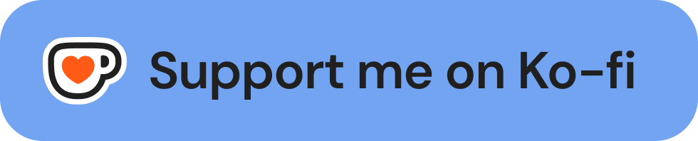</a>

<!-- ALL-CONTRIBUTORS-BADGE:START - Do not remove or modify this section -->
[](#contributors-)
<!-- ALL-CONTRIBUTORS-BADGE:END -->

# Pixelfin: Jellyfin Artwork Inspector

Pixelfin exists because I’m obsessive about Jellyfin artwork. I think what makes a library feel "premium" is having the right posters, backdrops, logos, thumbnails, ClearArt, banners, and other images. They make a library feel curated, browsable, and enjoyable to explore.

Pixelfin helps audit and review artwork in Jellyfin libraries. It shows what artwork each media item has, what’s missing, and what might need improvement. It checks image types like Primary, Backdrop, Logo, Art, Banner, Thumb, Box, Disc, Menu, and Season Posters, and it can flag images below a minimum resolution threshold.

The main point is simple: Pixelfin gives me a faster way to visually scan a library and make judgment calls like:

- This poster is too low-res.
- This movie deserves a better poster than what Jellyfin grabbed automatically.
- This backdrop technically exists, but it doesn’t represent the movie well.
- This show’s logo is missing.
- This anime has a poster, but none of the characters are on it.
- This thumbnail doesn’t have a logo on it.
- This poster doesn’t go with this backdrop.

**Disclaimer:** Pixelfin is vibecoded with Codex. I use it, it works well for me, and other people have found it useful too. That said, it’s still a local tool built by someone solving a very specific Jellyfin artwork problem, not a hardened production app.

**Security Note:** Pixelfin is not built with security in mind. Run it locally only, or on a trusted private network. Don’t expose it to the internet.

## What Changed in v1.0.0

Pixelfin v0.35.8 was mainly a Flask app around Python scripts that generated static HTML reports.

Pixelfin v1.0.0 turns Pixelfin into a proper local, server-backed web app. It keeps the core Jellyfin and Python logic, but adds cached scan state, dynamic library views, settings, restore review screens, and per-item updates.

You can now scan, filter, inspect, export, restore, and adjust rules from one interactive UI, while still keeping the classic HTML and ZIP exports when you want portable files.

Breaking or migration notes:

- The new app is now the default page at `http://localhost:1280`.
- The older classic interface is still available at `/classic`.
- v1.0.0 stores its server, library, scan, and settings state in `data/fresh.db`.
- Older v0.35.8 files like `data/history.json`, old generated HTML files, and old ZIP exports are not deleted.
- Existing exports under `output/<Library>/` stay where they are. Pixelfin can still list and download generated files from `output/`, but the new app uses its own settings and scan cache.

## Screenshots

### Light Mode
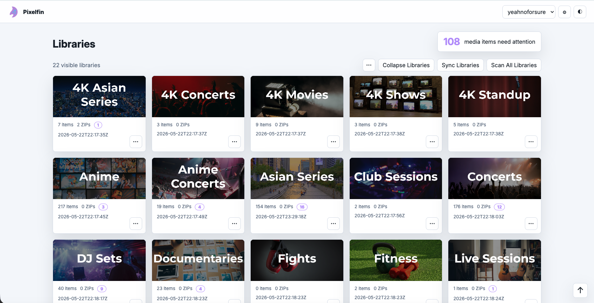

### Dark Mode
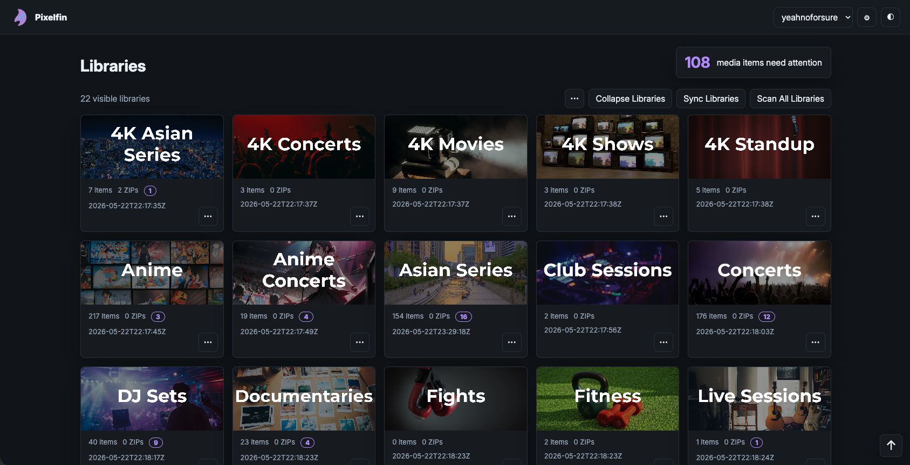

### Table
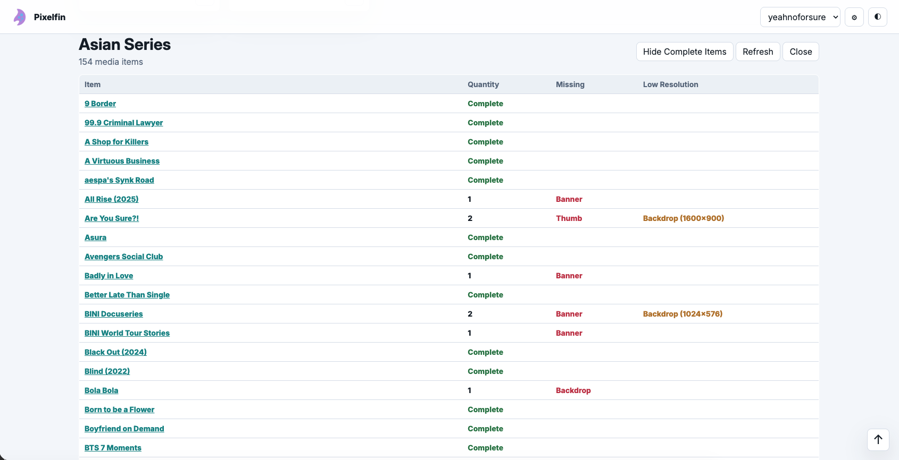

### All Images: Compact, Missing Images
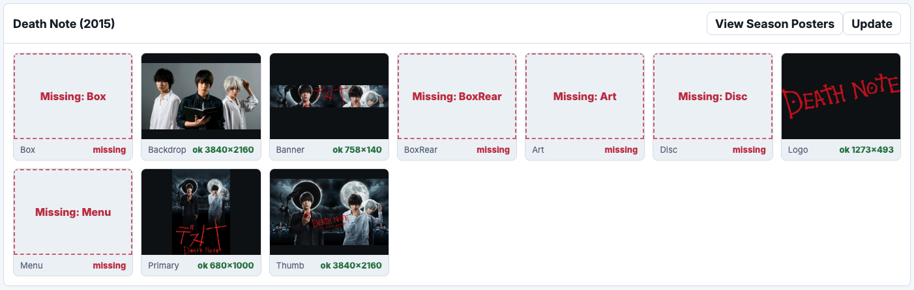

### All Images: Full, Missing and Low Resolution Images
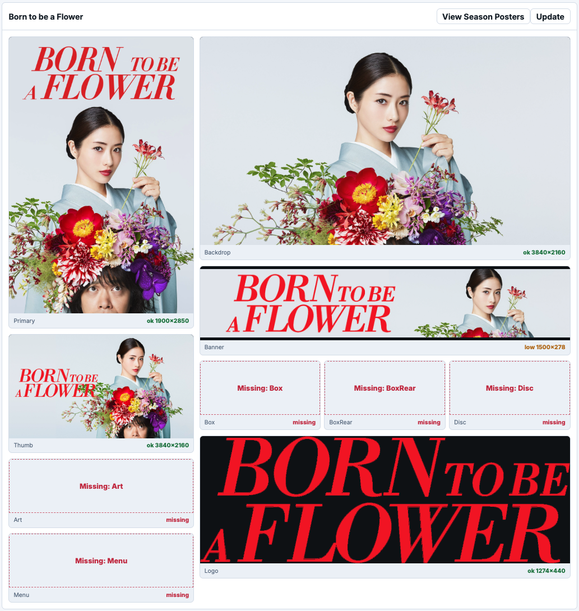

### Select Images: Compact, Low Resolution Image
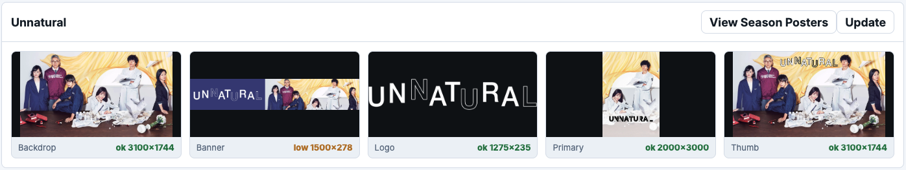

### Select Images: Full, Complete
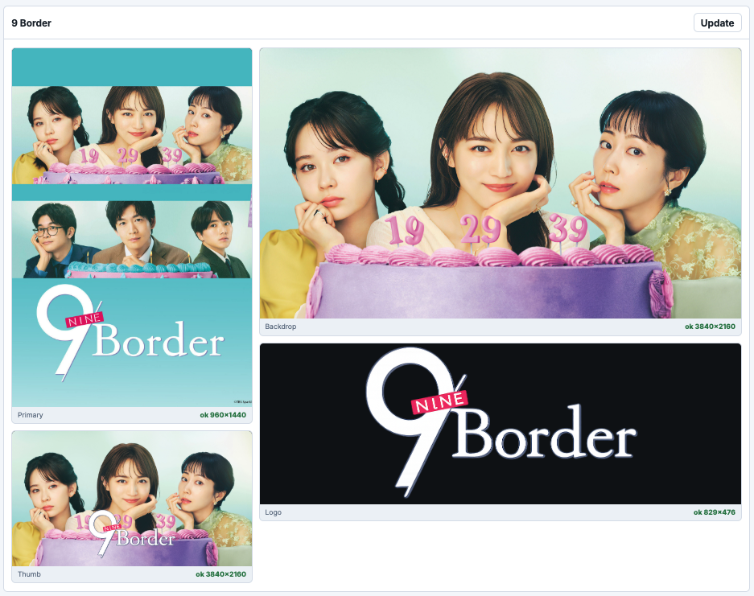

### Season Posters
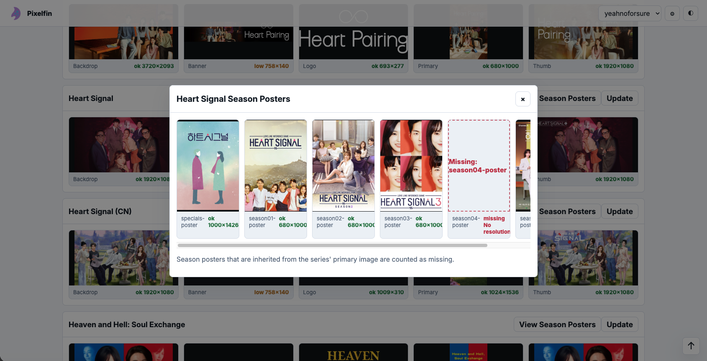

### Restore
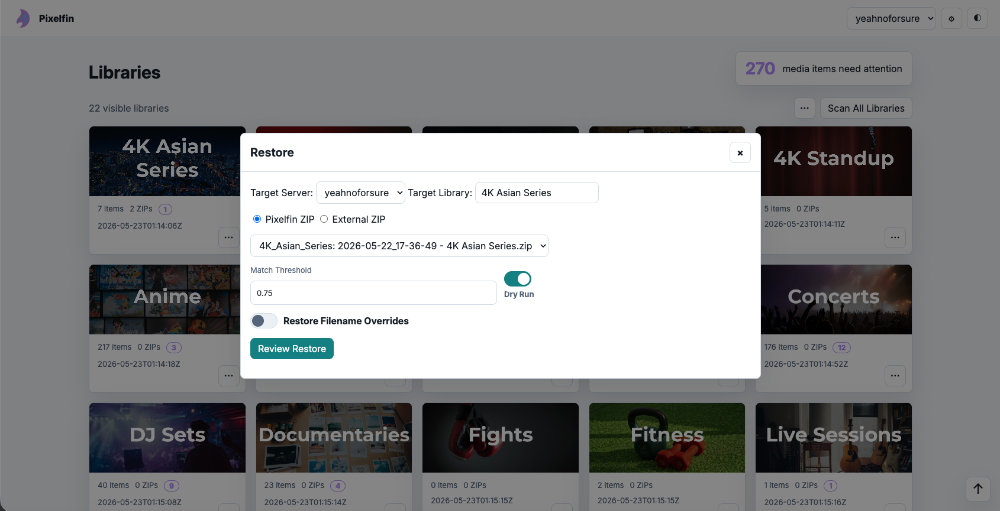

### Restore Review
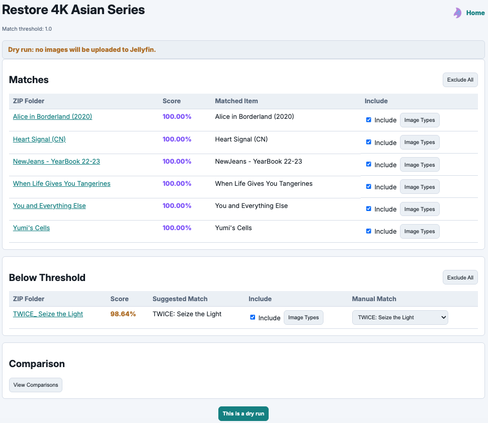

## Features

### Local Web App

- Add one or more Jellyfin servers.
- Sync Jellyfin libraries.
- Hide libraries you don’t want Pixelfin to show.
- View libraries as cards with Jellyfin thumbnails.
- See how many media items need attention.
- Click a library to review every scanned media item.
- Click a count to view only media items with missing or low-resolution artwork.
- Click a media item title to open that item in Jellyfin and take action.
- Use light or dark mode.

### Artwork Review

Pixelfin can show a summary table and visual gallery for each media item. It can flag missing images and images below your minimum resolution rules.

Supported image types include:

- Art
- Backdrop
- Banner
- Box
- BoxRear
- Disc
- Logo
- Menu
- Primary
- Season Posters
- Thumb

You can use the Full layout when you want the classic big visual review, or Compact layout when you want to scan quickly.

### Supported Jellyfin Library Types

Based on the current code, Pixelfin supports these Jellyfin library types:

- Series
- Movies
- Music
- Music Videos

Live TV, Collections, and Playlists are intentionally hidden because Pixelfin can’t work with those images correctly yet.

### Scanning and Updates

Pixelfin uses cached scan state so it doesn’t have to request every image from Jellyfin constantly. That keeps the app faster and helps avoid hammering Jellyfin while real clients are using it.

Because of that, changes made in Jellyfin don’t appear instantly. After changing artwork in Jellyfin, use one of these:

- `Update` on a single media item.
- `Refresh` while viewing a library.
- `Scan` from a library card.
- `Scan All Libraries` from the main screen.

### Image Rules

You can choose which image types matter for each library and set minimum resolution thresholds. There are global defaults, and you can override rules per library.

Season Posters are treated as a special image type. Pixelfin checks each season poster, and season posters inherited from the series primary image are counted as missing.

### JellyTag-Plus

If you use [JellyTag-Plus](https://github.com/nothing2obvi/jellyfin-plugins/tree/main/Jellytag), Pixelfin can request original images with `jellytag=off`. This applies to the main app display, scans, exports, and restore comparison previews.

### HTML Gallery Generation

Pixelfin can still generate classic-style HTML galleries. This is useful when you want a portable report outside the live app.

The generated HTML includes:

- A summary table.
- Gallery views of each media item.
- Missing image placeholders.
- Low-resolution warnings.
- Links back to Jellyfin items.
- Embedded image download support, so the HTML can be saved as a self-contained file.

### ZIP Export

Pixelfin can export selected artwork to ZIP. When you download a ZIP, Pixelfin also saves it internally under `output/<Library>/`.

ZIP exports are useful if you want to:

- Back up artwork outside Jellyfin.
- Move artwork to another server.
- Keep a snapshot before rebuilding.
- Restore artwork later.
- Share a set of images without saving artwork next to media files.

Some users save artwork alongside media files, and that’s totally valid. I personally don’t, because I like having Jellyfin store images on my NVMe SSD for faster access. ZIP backup and restore gives me a separate way to preserve artwork without changing how my media folders are organized.

### ZIP Restore

Pixelfin can restore artwork from a Pixelfin ZIP or an external ZIP.

The restore process includes:

- Dry-run mode.
- Match scores.
- Manual match selection for uncertain matches.
- Per-item include checkboxes.
- Per-image-type restore toggles.
- Side-by-side comparison in the Pixelfin UI.
- Filename override fields if your ZIP uses custom filenames.
- A full restore step after review.

Dry run means Pixelfin reviews what it would do without uploading anything to Jellyfin.

## Running Locally Without Docker

Requirements:

- Python 3.9 or newer.
- Pip.
- A Jellyfin server.
- A Jellyfin API key.

Install dependencies:

```bash
pip install -r requirements.txt
```

Run Pixelfin:

```bash
python app.py
```

Open:

```text
http://localhost:1280
```

If that doesn’t work, try:

```text
http://<local-ip>:1280
```

## Running with docker-compose-build.yml

Use this when you want Docker to build the image locally from this repository.

```bash
docker compose -f docker-compose-build.yml up -d --build
```

Then open:

```text
http://localhost:1280
```

The compose file uses relative folders:

- `./data:/app/data`
- `./output:/app/output`
- `./assets:/app/assets`

`data/` stores Pixelfin settings and scan state. `output/` stores generated HTML and ZIP files.

## Running with docker-compose.yml

Use this when you want the published Docker image from GitHub Container Registry.

```bash
docker compose up -d
```

The default image is:

```text
ghcr.io/nothing2obvi/pixelfin:latest
```

The release image for v1.0.0 is:

```text
ghcr.io/nothing2obvi/pixelfin:v1.0.0
```

Open:

```text
http://localhost:1280
```

## Docker Images

The v1.0.0 Docker release is intended to publish multi-architecture images for:

- `linux/amd64`
- `linux/arm64`

Tags:

- `ghcr.io/nothing2obvi/pixelfin:v1.0.0`
- `ghcr.io/nothing2obvi/pixelfin:latest`

## Useful Notes

- Pixelfin talks to Jellyfin through the Jellyfin API.
- Large libraries can take time to scan.
- Full library scans request many images from Jellyfin, so don’t run them constantly if your server is busy.
- The app is designed for one local user.
- The classic page is still available at `/classic` for now.
- `output/` can grow if you generate a lot of exports. The Auto settings can limit how many ZIPs are kept per library.

## Want to Contribute?

Pixelfin is a practical little tool that grew out of me wanting my Jellyfin artwork to look better. If you see a bug, have a better way to structure something, or want to improve the UI, pull requests and issues are welcome.

Some ideas:

- Better bulk review workflows.
- Better progress reporting.
- More per-library defaults.
- Smarter artwork quality checks.

## License

MIT, feel free to use, modify, and share.

## Contributors ✨

Thanks goes to these wonderful people ([emoji key](https://allcontributors.org/docs/en/emoji-key)):

<!-- ALL-CONTRIBUTORS-LIST:START -->
<!-- prettier-ignore-start -->
<!-- markdownlint-disable -->
<table>
  <tbody>
    <tr>
      <td align="center" valign="top" width="14.28%"><a href="https://github.com/LoV432"><br /><sub><b>LoV432</b></sub></a><br /><a href="https://github.com/nothing2obvi/pixelfin/commits?author=LoV432" title="Code">💻</a></td>
      <td align="center" valign="top" width="14.28%"><a href="https://github.com/avassor"><br /><sub><b>avassor</b></sub></a><br /><a href="#ideas-avassor" title="Ideas, Planning, & Feedback">🤔</a> <a href="https://github.com/nothing2obvi/pixelfin/pulls?q=is%3Apr+reviewed-by%3Aavassor" title="Reviewed Pull Requests">👀</a></td>
      <td align="center" valign="top" width="14.28%"><a href="https://github.com/KingOfBadgers"><br /><sub><b>KingOfBadgers</b></sub></a><br /><a href="https://github.com/nothing2obvi/pixelfin/commits?author=KingOfBadgers" title="Code">💻</a></td>
    </tr>
  </tbody>
</table>

<!-- markdownlint-restore -->
<!-- prettier-ignore-end -->

<!-- ALL-CONTRIBUTORS-LIST:END -->

This project follows the [all-contributors](https://github.com/all-contributors/all-contributors) specification. Contributions of any kind are welcome.
