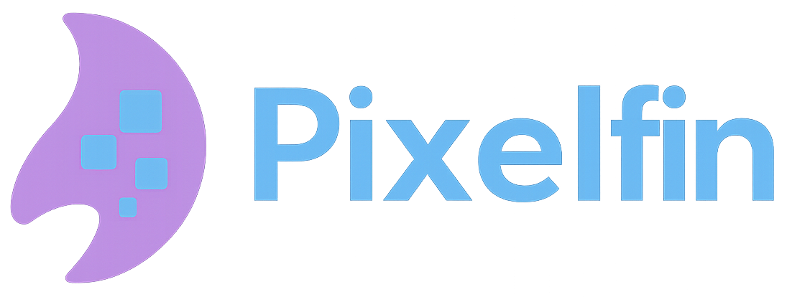
<!-- ALL-CONTRIBUTORS-BADGE:START - Do not remove or modify this section -->
 
<!-- ALL-CONTRIBUTORS-BADGE:END -->

# Pixelfin – Jellyfin Image Inspector

Do you want your images on your Jellyfin instance to be perfect?

Do you ever wonder which image types you're missing or are low resolution?

Do you want an easy way to back up and restore your Jellyfin library images?

A big part of what makes a media library feel “premium” is its artwork. Consistent, high-quality posters, backdrops, logos, thumbnails, and other images transform a collection of files into something that feels curated, browsable, and enjoyable to explore.

Pixelfin is a lightweight Flask app paired with a generator script that lets you quickly create HTML galleries of your Jellyfin libraries, giving you a clear view of your media artwork so you can easily spot areas for improvement. It highlights which image types, such as Primary, ClearArt, Backdrops, Logos, and more, are present, which are missing, and which fall below a minimum resolution threshold you specify.

The result is a clean, scrollable gallery with clickable images, along with a summary table showing missing and low-resolution images. You can click on titles in the summary table to jump directly to that entry’s images. Within each entry, clicking the title takes you straight to the media item in Jellyfin, so you can quickly review and make changes.

In addition, Pixelfin lets you bundle images into either HTML files or ZIP archives, either manually or in an automated fashion, choose exactly which ones to include, and even override filenames so you can save them under names that fit your own organization. When downloaded, HTML reports can embed the images directly for a fully self-contained file; otherwise, they simply reference and load images from your server.

Finally, Pixelfin can restore a library’s images from a ZIP archive generated by Pixelfin. It includes a dry-run mode for safe previews, a configurable matching threshold, the ability to manually confirm matches below that threshold, and an optional comparison HTML view to easily inspect before-and-after results.

---

## Screenshots

### Dark Mode
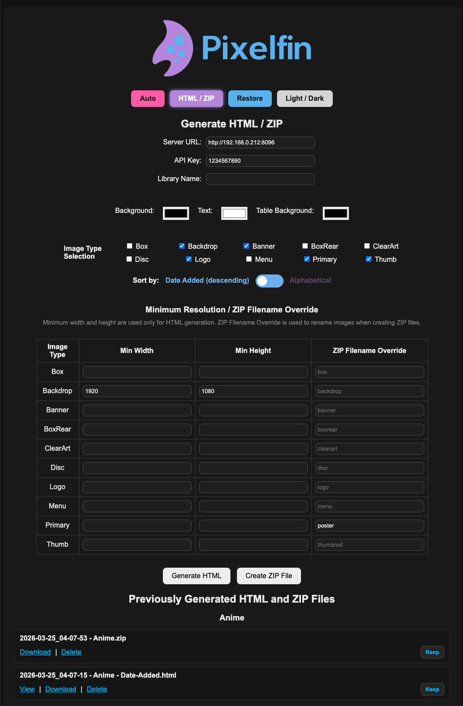

### Light Mode
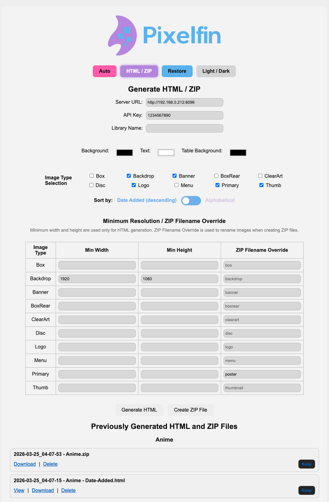

### Auto
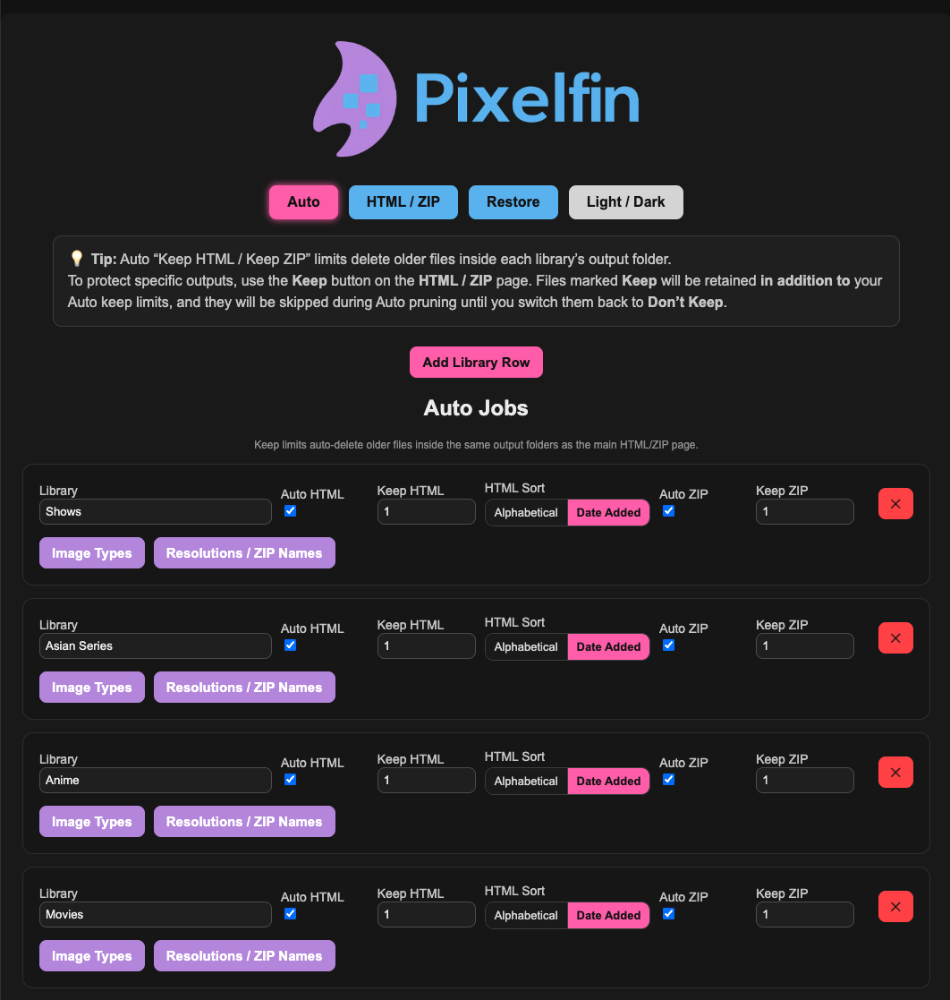

### Restore
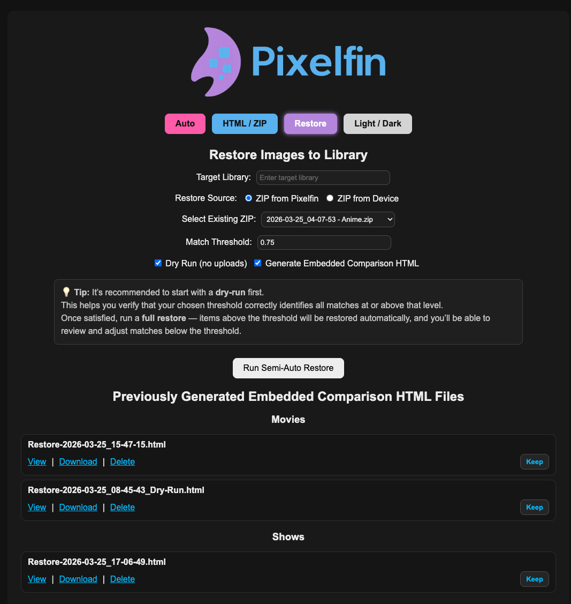

### All Image Types - Summary Table
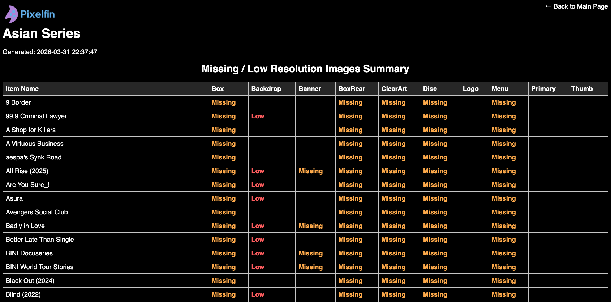

### All Image Types - Entry with Missing Images
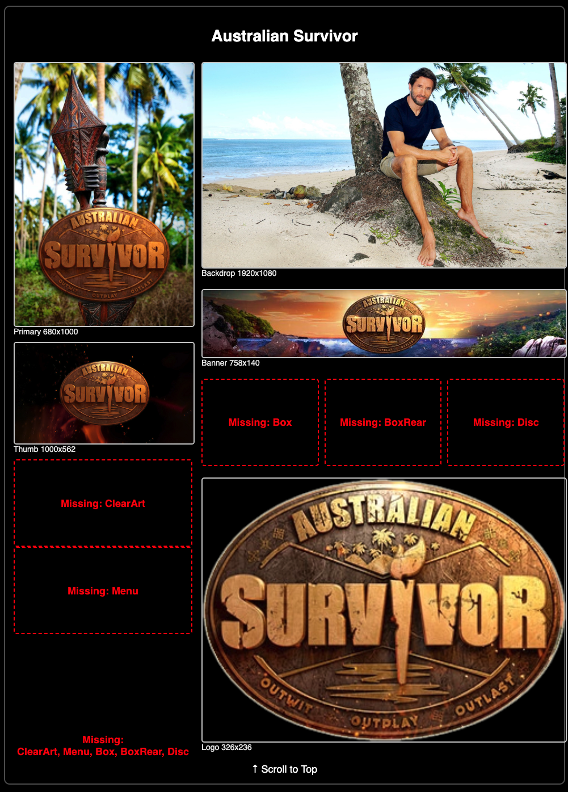

### Certain Image Types - Entry with No Missing Images

### Certain Image Types - Entry with Missing Images
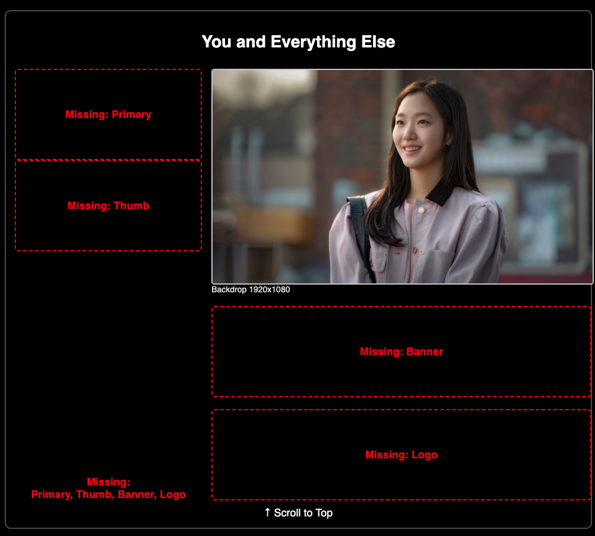

### Certain Image Types - Entry with Low Resolution Images
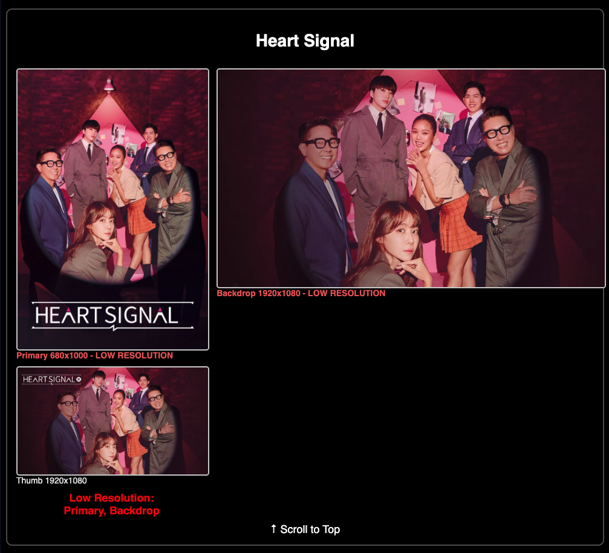

### Certain Image Types - Entry with Both a Missing Image and a Low Resolution Image
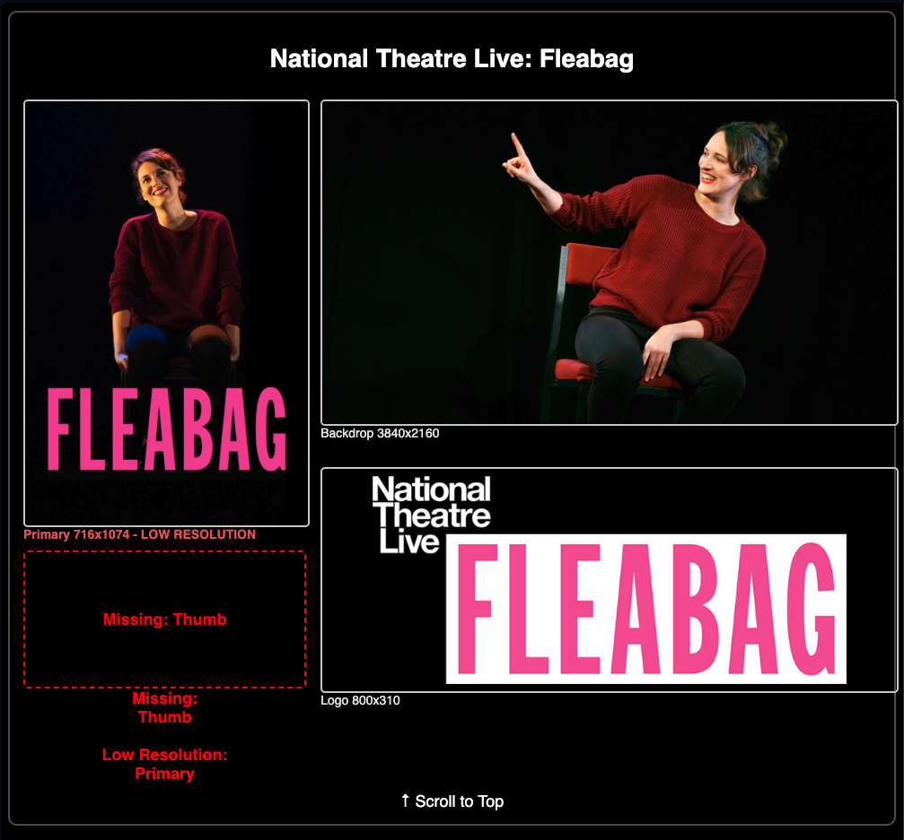

### Lightbox with Navigation
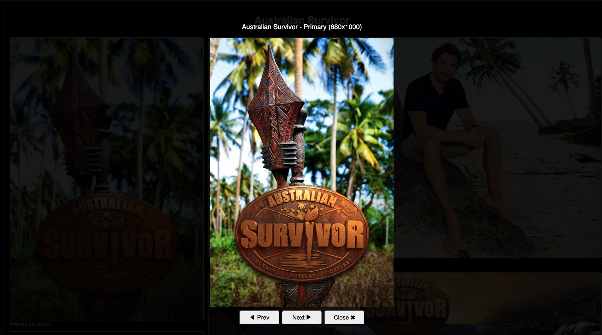

### Pick Your Colors 1
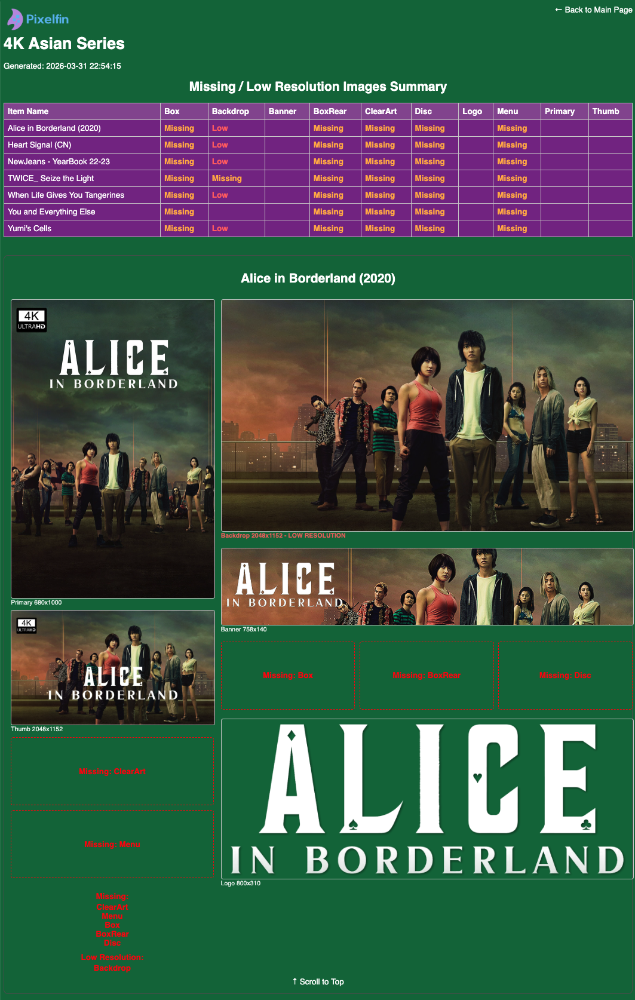

### Pick Your Colors 2
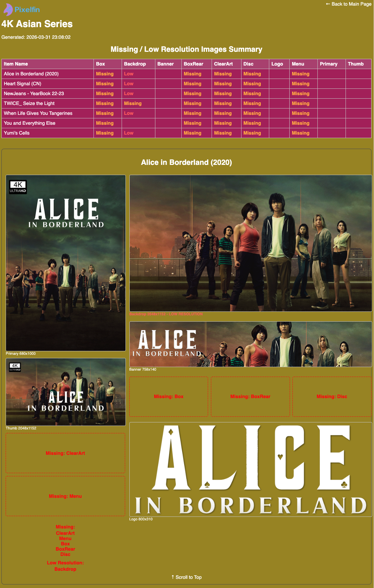

### Pick Your Colors 3
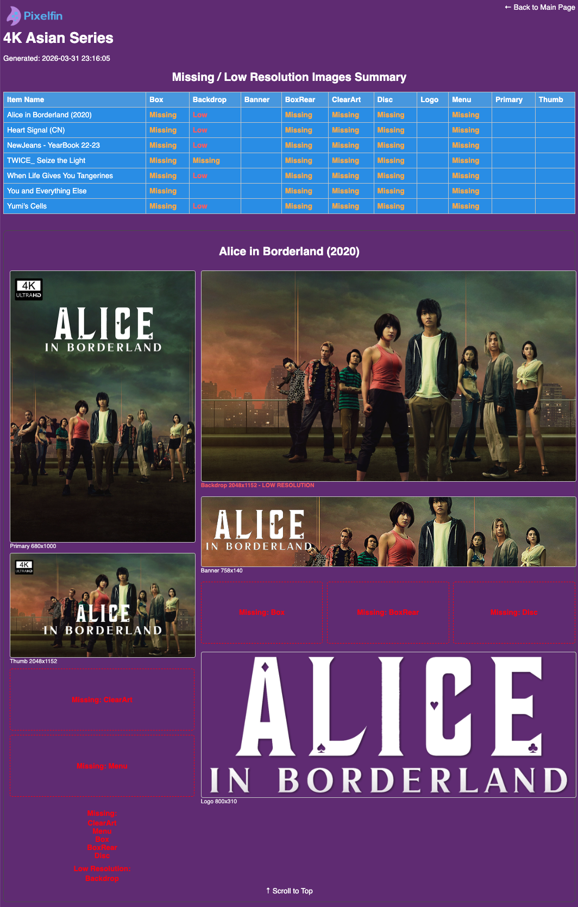

## 🙋 About This Project

This project is **functional, not perfect or polished**.

If you try it out:
- Depending on the size of the library, it can take some time to generate an HTML or ZIP file.
- If it doesn't work on http://localhost:1280 try `http://<local-ip>:1280`

I vibe-coded this project entirely with ChatGPT, because I have literally zero coding experience. I have thoroughly tested it, it works for me, and I actively use it to keep track of artwork across my Jellyfin instance. If you’re more experienced with coding than I am (which is basically everyone), you’ll almost certainly see ways to improve it. Contributions, fixes, and feedback are all very welcome.

## ⚠️ Security Notice

Pixelfin is not designed with security as a primary focus and should be considered unsafe for public exposure. It is intended for use in trusted, private environments only. Do not expose Pixelfin to the internet or run it on publicly accessible servers.

## ✨ Features

### Interactive Web Interface
- Connect with your Jellyfin server using your API key and selected library name  
- Choose gallery colors and image types to include  
- Generate new HTML reports or ZIP files with a single click  
- Browse previously generated galleries, download them with embedded images, or delete them  
- Download or delete previously generated ZIP files  
- Light and dark mode  

### Clean, Actionable Galleries (HTMLs)
- Summary table at the top showing missing/low-resolution types; click an item’s title to jump directly to it  
- Each library item displayed with its available images  
    - Each item’s title links directly to its Jellyfin page for quick editing  
    - Left column: Primary, Thumb, ClearArt, Menu  
    - Right column: Backdrop, Banner, Box, BoxRear, Disc, Logo  
    - Image type and resolution labels under each image  
    - Missing images highlighted with red placeholders  
    - Low-resolution images flagged with red captions  
    - Missing or low-resolution image types clearly listed in red on the bottom left  
    - “Scroll to top” links for easy navigation  
    - Clickable images with a lightbox viewer (Prev / Next / Close)  
- Download embedded HTMLs for fully self-contained, shareable galleries  

### Custom ZIP Exports (ZIPs)
- Bundle selected images into a downloadable ZIP archive  
- Override filenames so images are saved under your preferred naming scheme  
- Perfect for exporting, reorganizing, or sharing artwork outside Jellyfin  

### Auto Tab (Automation)
- Schedule automatic generation of HTML reports and ZIP files using cron  
- Configure separate schedules for HTML and ZIP outputs  
- Define how many recent HTMLs and ZIPs to keep  
- Option to mark specific outputs as “kept,” preventing them from being deleted even when exceeding set limits  
- Automatically organizes outputs into timestamped directories  
- Designed for hands-off, continuous maintenance of your image reports and archives  

### Restore Tab (Image Restoration)
- Restore library images directly from a Pixelfin-generated ZIP file or external ZIP source  
- **Dry run mode:** Preview all changes without uploading anything to Jellyfin  
- **Comparison HTML:** Generate a visual before-and-after report to verify changes before applying them  
- **Matching threshold:** Set a similarity threshold (default 0.75) to control how strictly items are matched  
- **Manual match selection:** For items below the threshold, manually choose the correct match before restoring  
- Supports restoring multiple image types (Primary, Backdrop, Banner, Logo, etc.)  
- Handles movies, series (including seasons), music, and music video libraries  
- Provides clear feedback and reporting for all restored items  

---

## 🚀 Installation (Without Docker)

### Requirements

- Python 3.9+
- Pip
- A Jellyfin server + API key

### Install dependencies

pip install Flask pillow requests

### Run the app

python app.py

Then open your browser to:

http://localhost:1280

If that doesn't work, try:

http://<local-ip>:1280

---

## 🐳 Running with Docker

### Build the image

docker build -t ghcr.io/nothing2obvi/pixelfin:latest .

### Run the container

cd /path/to/pixelfin

docker run -d \
  -p 1280:1280 \
  -e TZ=America/Chicago \
  -v ./output:/app/output \
  -v ./data:/app/data \
  ghcr.io/nothing2obvi/pixelfin:latest

Go to: http://localhost:1280

---

## 🐙 Docker Compose

services:
  pixelfin:
    image: ghcr.io/nothing2obvi/pixelfin:latest
    container_name: pixelfin
    ports:
      - "1280:1280"
    environment:
      - TZ=America/Chicago
    volumes:
      - ./output:/app/output
      - ./data:/app/data
    restart: unless-stopped

Run:

docker compose up -d

---

## ⚠️ Limitations

- Error handling is minimal
- Only tested with my setup (Mac + Jellyfin 10.11.7)
- Only tested with the following library types: Series, Movies, Music Videos, Music

---

## 🤝 Want to Contribute?

Pixelfin is a work in progress, and contributions are welcome.

> Have an idea or want to help out? Open a pull request.

---

## 📝 License

MIT – feel free to use, modify, and share.

---

## Contributors ✨

Thanks goes to these wonderful people ([emoji key](https://allcontributors.org/docs/en/emoji-key)):

<!-- ALL-CONTRIBUTORS-LIST:START -->
<!-- ALL-CONTRIBUTORS-LIST:END -->

This project follows the [all-contributors](https://github.com/all-contributors/all-contributors) specification. Contributions of any kind welcome!