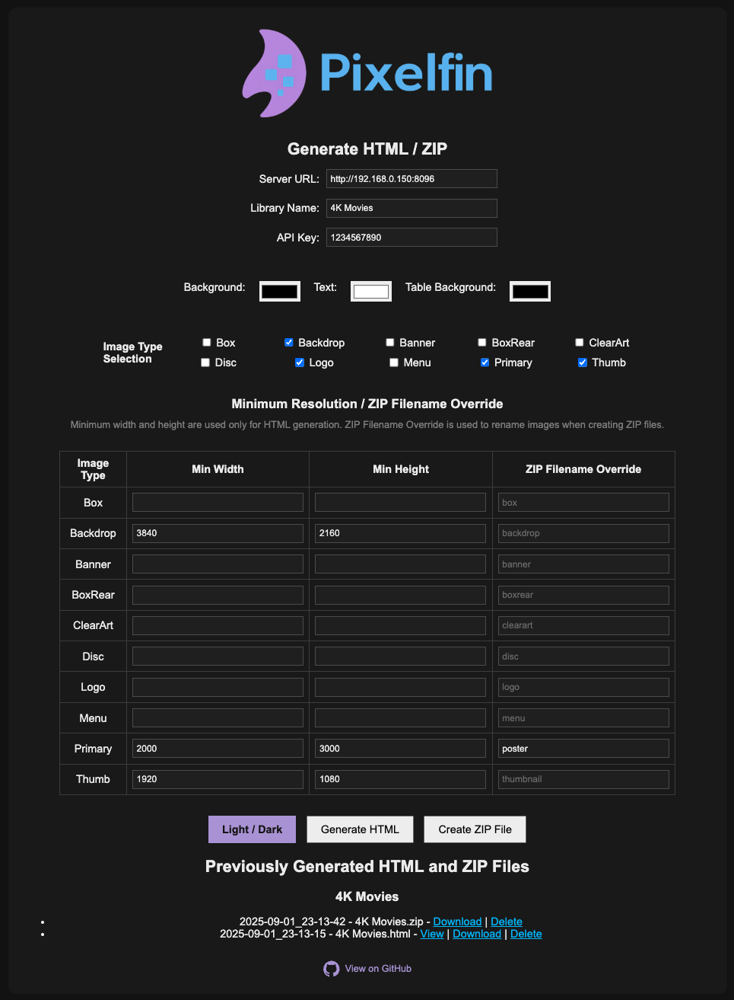
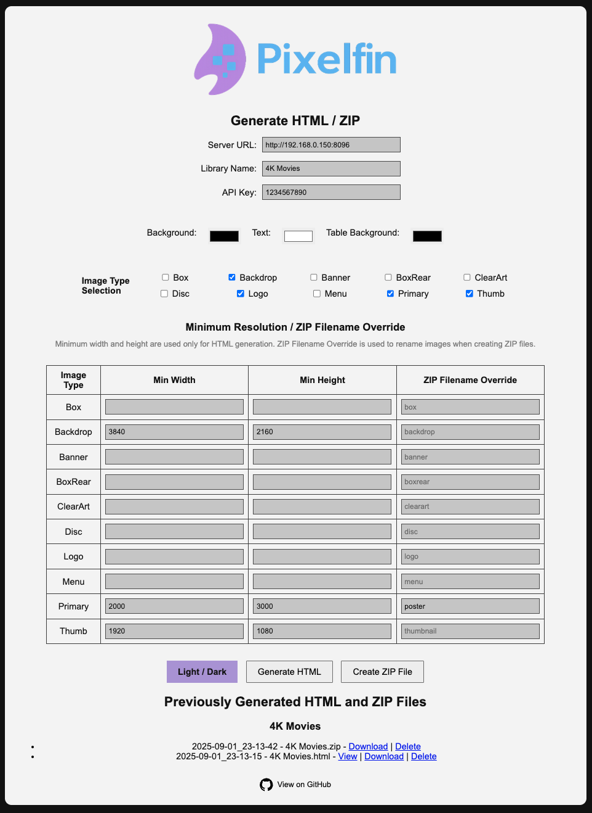
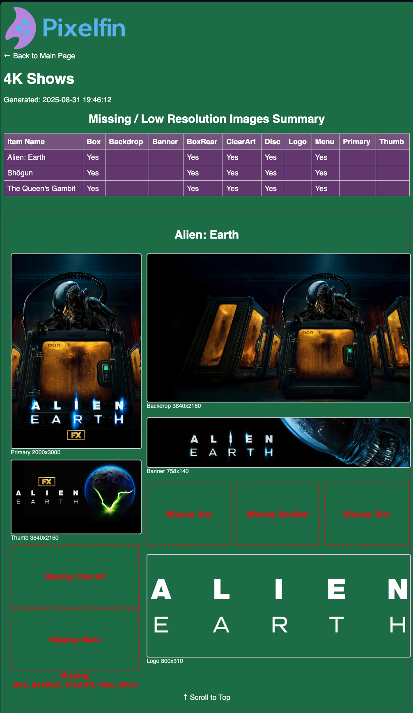

<!-- ALL-CONTRIBUTORS-BADGE:START - Do not remove or modify this section -->
[](#contributors-) [](CHANGELOG.md)
<!-- ALL-CONTRIBUTORS-BADGE:END -->

# Pixelfin – Jellyfin Image Inspector

Do you want your images on your Jellyfin instance to be perfect?

Do you ever wonder which image types you're missing or are low resolution?

Do you want an easy way to back up your Jellyfin library images?

Pixelfin is a lightweight Flask app paired with a generator script that lets you quickly create HTML galleries of your Jellyfin libraries. It highlights which image types — such as Primary, ClearArt, Backdrops, Logos, and more — are present, which are missing, and which fall below a minimum resolution threshold you specify. The result is a clean, scrollable gallery with clickable images, accompanied by a summary table showing missing and low-resolution images. In addition, Pixelfin lets you bundle images into ZIP archives, choose exactly which ones to include, and even override filenames so you can save them under names that fit your own organization.

I vibe-coded this project entirely with ChatGPT, because I have literally zero coding experience. It works for me, and I personally use it to keep track of artwork across my Jellyfin setup. If you’re more experienced with coding than I am (which is basically everyone), feel free to improve it or collaborate — I’d love that.

---

## Screenshots

### Dark Mode


### Light Mode


### All Image Types - Summary Table


### All Image Types - Entry with Missing Images


### Certain Image Types - Summary Table


### Certain Image Types - Entry with No Missing Images


### Certain Image Types - Entry with Missing Images


### Certain Image Types - Entry with Low Resolution Images


### Certain Image Types - Entry with Both a Missing Image and a Low Resolution Image


### Lightbox with Navigation


### Pick Your Colors 1


### Pick Your Colors 2
[Screenshot_Color2](assets/Screenshot_Color2.png)

### Pick Your Colors 3
[Screenshot_Color3](assets/Screenshot_Color3.png)

## 🙋 About This Project

This project is **functional, not perfect or polished**.

If you try it out:
- If it won't start, make sure `history.json` exists as an **empty file**, not a folder. Then rebuild the container (not just restart it).
- Depending on the size of the library, it can take some time to generate an HTML or ZIP file.
- If it doesn't work on http://localhost:1280 try `http://<local-ip>:1280`

This tool works for me, and I actively use it to manage artwork in my own Jellyfin setup. If you’re more experienced, you’ll almost certainly see ways to improve it. Contributions, fixes, and feedback are all very welcome, but I honestly wouldn't know how to act upon them without help. I'm just being real with you. I’d love to collaborate with anyone who finds this interesting.

## ✨ Features

### Interactive Web Interface
- Connect with your Jellyfin server using your API key and selected library name  
- Choose gallery colors and image types to include  
- Generate new HTML reports or ZIP files with a single click  
- Browse previously generated galleries, download them with embedded images, or delete them
- Download or delete previously generated ZIP files
- Light and dark mode

### Clean, Actionable Galleries
- Summary table at the top showing missing/low-resolution types; click an item’s title to jump directly to it  
- Each library item displayed with its available images  
- Missing images highlighted with red placeholders  
- Low-resolution images flagged with red captions  
- Clickable images with a lightbox viewer (Prev / Next / Close)  

### Smart Image Details
- Each item’s title links directly to its Jellyfin page for quick editing  
- Image type and resolution shown beneath every image (e.g. *Backdrop 1920×1080*)  
- Missing or low-resolution image types clearly listed in red so you never miss them  

### Custom ZIP Exports
- Bundle selected images into a downloadable archive  
- Choose exactly which image types to include  
- Override filenames so images are saved under your preferred naming scheme  
- Perfect for exporting, reorganizing, or sharing artwork outside Jellyfin  

---

## 🚀 Installation (Without Docker)

### Requirements

- Python 3.9+
- Pip
- A Jellyfin server + API key

### Install dependencies

```bash
pip install flask pillow requests

```

### Run the app

```bash
python app.py

```

Then open your browser to:

```
http://localhost:1280

```

---

## 🐳 Running with Docker

If you prefer Docker, you can run it without installing Python locally.

### Build the image

```bash
docker build -t ghcr.io/nothing2obvi/pixelfin:latest .

```

### Run the container

1. **Create an empty `history.json` (if you don’t have one):**

```bash
echo "{}" > history.json
```

2. Start the container

```bash
docker run -d \
  -p 1280:1280 \
  -e TZ=America/Chicago \
  -v $(pwd)/output:/app/output \
  -v $(pwd)/data:/app/data \
  ghcr.io/nothing2obvi/pixelfin:latest
```

`output/` will store the generated HTML reports.

`history.json` will persist your server/library selections and other settings.

3. Open Pixelfin

Go to: http://localhost:1280 to access Pixelfin. If it doesn't work on http://localhost:1280 try `http://<local-ip>:1280`

---

## 🐙 Docker Compose

Here’s a simple `docker-compose.yml`:

```yaml
services:
  pixelfin:
    image: ghcr.io/nothing2obvi/pixelfin:latest
    container_name: pixelfin
    ports:
      - "1280:1280"
    environment:
      - TZ=America/Chicago
    volumes:
      - ./output:/app/output
      - ./data:/app/data
    restart: unless-stopped
```

Run it with:

```bash
docker compose up -d
```

Go to: http://localhost:1280 to access Pixelfin. If it doesn't work on http://localhost:1280 try `http://<local-ip>:1280`

---

## 🛠 How It Works

1. Start the app (`python app.py` or via Docker). See **About this Project** if it’s not working.  
2. Fill in:  
   - **Server URL** – your Jellyfin base URL (e.g. `http://192.168.1.100:8096`)  
   - **Library Name** – the library you want to inspect (e.g. `Movies`)  
   - **API Key** – create this in Jellyfin’s admin dashboard  
   - Pick the colors, image types, and optional minimum resolution thresholds you want  
3. Hit **Generate**.  
   - A background thread runs `generate_html.py`, which talks to Jellyfin’s API, fetches all your items, and checks every image type.  
   - A timestamped `.html` file gets saved under `output/<LibraryName>/`.  
4. Browse results:  
   - View the gallery in your browser  
   - Click an item’s title to jump directly into Jellyfin and fix missing images  
   - Download an “embedded” version where all images are base64-encoded (for sharing/archiving)  
5. Create ZIP files of your images (optional):  
   - Select which images you want to bundle into a `.zip` archive  
   - Use the **Filename Override** column in the table to rename images before exporting  
   - Handy for reorganizing or sharing artwork outside Jellyfin  
   - ⚡ **Note:** The **Resolution** column is only used when generating HTML galleries, while the **Filename Override** column applies only when creating ZIP archives  

---

## 📊 Example Gallery

- **Top summary table** – shows each item with checkmarks where images are missing
- **Entries below** – each item gets its own block with:
  - Left column: Primary, Thumb, ClearArt, Menu
  - Right column: Backdrop, Banner, Box, BoxRear, Disc, Logo
  - Missing image placeholders in red
  - Low resolution images have red captions
  - Resolution labels under each image
  - “Scroll to top” links for easy navigation
  
## 📝 Note About Embedded HTML Files
  
- When opening the downloaded, embedded HTML files **directly from your filesystem**, you may see bits of text like `class="..."`, `alt="..."`, or `loading="lazy"` appearing beneath the images. This is just a browser rendering quirk and does not affect how the gallery works.
- For a clean viewing experience, place the HTML files inside the `/output` directory of your Pixelfin instance — either within one of the existing library folders or a new folder you create (it must be inside a folder). The files will then appear on the main page, and selecting **View** will display them properly.

---

## ⚠️ Limitations

- Error handling is minimal
- Only tested with my setup (Mac + Jellyfin 10.10.7)
- Only tested with the following library types: Shows, Movies, Music Videos, Music

---

## 🤝 Want to Improve This?

There's a ton of room to make this better, and I'd appreciate collaborators:

- Sleeker UI
- A list on the main page of items that need attention
- Ability to "check off" a media item as completed

---

## 📝 License

MIT – feel free to use, modify, and share.
## Contributors ✨

Thanks goes to these wonderful people ([emoji key](https://allcontributors.org/docs/en/emoji-key)):

<!-- ALL-CONTRIBUTORS-LIST:START - Do not remove or modify this section -->
<!-- prettier-ignore-start -->
<!-- markdownlint-disable -->
<table>
  <tbody>
    <tr>
      <td align="center" valign="top" width="14.28%"><a href="https://github.com/LoV432"><br /><sub><b>LoV432</b></sub></a><br /><a href="https://github.com/nothing2obvi/pixelfin/commits?author=LoV432" title="Code">💻</a></td>
      <td align="center" valign="top" width="14.28%"><a href="https://github.com/avassor"><br /><sub><b>avassor</b></sub></a><br /><a href="#ideas-avassor" title="Ideas, Planning, & Feedback">🤔</a> <a href="https://github.com/nothing2obvi/pixelfin/pulls?q=is%3Apr+reviewed-by%3Aavassor" title="Reviewed Pull Requests">👀</a></td>
    </tr>
  </tbody>
</table>

<!-- markdownlint-restore -->
<!-- prettier-ignore-end -->

<!-- ALL-CONTRIBUTORS-LIST:END -->

This project follows the [all-contributors](https://github.com/all-contributors/all-contributors) specification. Contributions of any kind welcome!