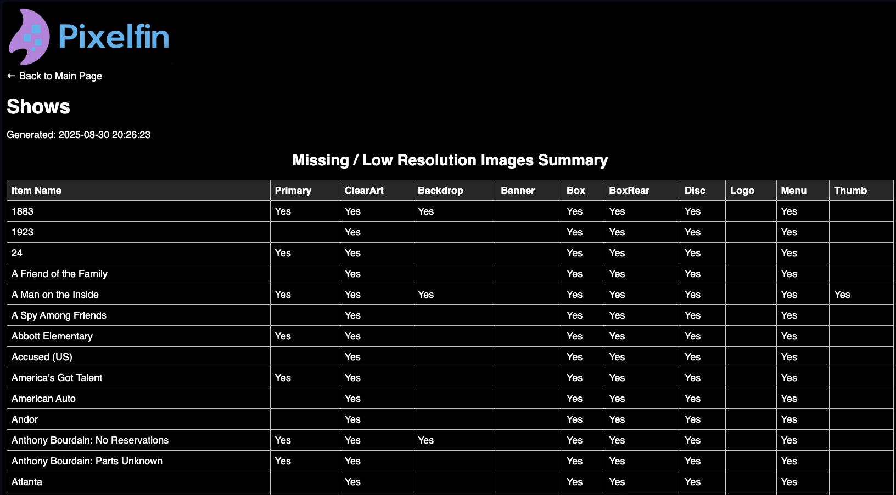

# Pixelfin – Jellyfin Image Inspector

Do you want your images on your Jellyfin instance to be perfect?

Do you ever wonder which image types you're missing?

Pixelfin is a lightweight Flask app combined with a generator script that enables you to quickly create HTML galleries for your Jellyfin libraries. It visually displays the different image types (Primary, ClearArt, Backdrops, Logos, etc.) present in your media, as well as highlighting any missing ones. You can choose with image types you'd like Pixelfin to track. The app generates a summary table of missing images, a scrollable gallery with clickable images, and a lightbox that lets you navigate through each entry's images. Red placeholders indicate missing images, and a list of these missing images is shown in red, ensuring you don’t overlook any. The titles in the table link directly to their respective entries, and each entry title takes you to the corresponding media item in Jellyfin, making it easy to edit or add images.

I built this entirely with **ChatGPT**, because I have **literally zero coding experience**. It works for me, and I personally use it to keep track of artwork across my Jellyfin setup. If you’re better at coding than me (which is basically everyone), feel free to improve it or collaborate — I’d love that.

---

## Screenshots

### All Images - Summary Table


### All Images - Entry with Missing Images


### Certain Images - Summary Table


### Certain Images - Entry with No Missing Images


### Lightbox with Navigation


## 🙋 About This Project

This project is **functional, not perfect or polished**.
 
I have **literally zero coding experience** — everything here was stitched together with the help of ChatGPT. I thought it might be useful to someone else, so I decided to share it. Please be kind and patient if you run into rough edges.

If you try it out: 
- Make sure `history.json` exists as an **empty file**, not a folder.
- If it doesn't work when first starting it up, try **restarting** it.
- Depending on the size of the library, it can take some time to generate the HTML file.
- I'm aware of the stray `>` underneath the logo on the generated HTML file. Believe me, I've tried to remove it.  

This tool works for me, and I actively use it to manage artwork in my own Jellyfin setup. If you’re more experienced, you’ll almost certainly see ways to improve it. Contributions, fixes, and feedback are all very welcome, but I honestly wouldn't know how to act upon them without help. I'm just being real with you. I’d love to collaborate with anyone who finds this interesting.

---

## ✨ Features

- **Web interface (Flask app)**
	- Enter your Jellyfin server, API key, and library name
	- Choose colors for the gallery
	- Select which image types to include
	- Generate new HTML reports
	- View previously generated galleries, download them with embedded images, or delete them
- **Automatic galleries (generate_html.py)**
	- Each item in the library with its images
	- Missing images highlighted with placeholders
	- A summary table at the top listing which image types each item is missing; clicking on a title directs you to that entry
	- Clickable images with a lightbox viewer (Prev / Next / Close)
- **Direct links to Jellyfin**
	
	Each item’s title links directly to its page in Jellyfin’s web UI so you can take action and make edits.
	
- **Image resolution display**
	
	Under every image, it shows the resolution (e.g. 1920×1080).
	
- **Missing image callouts**
	
	For each entry, missing image types are listed in red so you don’t miss them.
	

---

## 🚀 Installation (Without Docker)

### Requirements

- Python 3.9+
- Pip
- A Jellyfin server + API key

### Install dependencies

```bash
pip install flask pillow requests

```

### Run the app

```bash
python app.py

```

Then open your browser to:

```
http://localhost:1280

```

---

## 🐳 Running with Docker

If you prefer Docker, you can run it without installing Python locally.

### Run the container

```bash
docker run -d \
  -p 1280:1280 \
  -v $(pwd)/output:/app/output \ # where HTML files go
  -v $(pwd)/assets:/app/assets \
  -v $(pwd)/history.json:/app/history.json \
  --name pixelfin \
  ghcr.io/nothing2obvi/pixelfin:latest

```

- `output/` will store the generated HTML reports

Then open your browser to `http://localhost:1280`.

---

## 🐙 Docker Compose

Here’s a simple `docker-compose.yml`:

```yaml
services:
  pixelfin:
    image: ghcr.io/nothing2obvi/pixelfin:latest
    container_name: pixelfin
    ports:
      - "1280:1280"
    volumes:
      - ./output:/app/output # where HTML files go
      - ./assets:/app/assets
      - ./history.json:/app/history.json
    restart: unless-stopped
```

Run it with:

```bash
docker compose up -d
```

---

## 🛠 How It Works

1. Start the app (`python app.py` or via Docker). See `About this Project` if it's not working.
2. Fill in:
	- **Server URL** – your Jellyfin base URL (e.g. `http://192.168.1.100:8096`)
	- **Library Name** – the library you want to inspect (e.g. `Movies`)
	- **API Key** – create this in Jellyfin’s admin dashboard
	- Pick colors and image types if you want
3. Hit **Generate**.
	- A background thread calls `generate_html.py`, which talks to Jellyfin’s API, fetches all your items, and checks every image type.
	- A timestamped `.html` file gets saved under `output/<LibraryName>/`.
4. Browse results:
	- View the gallery in your browser
	- Click an item’s title to jump directly into Jellyfin and fix missing images
	- Download an “embedded” version where all images are base64-encoded (for sharing/archiving)

---

## 📊 Example Gallery

- **Top summary table** – shows each item with checkmarks where images are missing
- **Entries below** – each item gets its own block with:
	- Left column: Primary, Thumb, ClearArt, Menu
	- Right column: Backdrop, Banner, Box, BoxRear, Disc, Logo
	- Missing image placeholders in red
	- Resolution labels under each image
	- “Scroll to top” links for easy navigation

---

## ⚠️ Limitations

- Error handling is minimal
- Only tested with my setup (Mac + Jellyfin 10.10.7)
- Only tested with the following library types: Shows, Movies, Music Videos, Music

---

## 🤝 Want to Improve This?

If you know Python, Flask, or front-end design, there’s a ton of room to make this better:

- Cleaner UI
- Smarter caching
- Async image fetching
- Export to other formats (CSV, PDF, etc.)
- Per-library configs

I’d be really interested in collaborating if anyone else likes this idea.

---

## 📝 License

MIT – feel free to use, modify, and share.